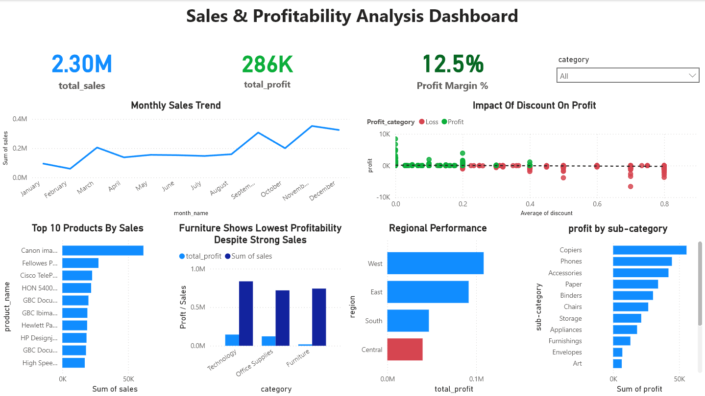

#  Retail Sales & Profitability Analysis Dashboard

##  Project Overview

This project analyzes retail sales data to uncover key business insights related to profitability, discount strategies, and regional performance. The goal was to identify loss-making areas and provide actionable recommendations using data analysis and visualization.

---

##  Objectives

* Identify top-performing products
* Detect loss-making categories and sub-categories
* Analyze the impact of discounts on profitability
* Evaluate regional sales and profit performance
* Understand seasonal sales trends

---

##  Tools & Technologies

* **Python (Pandas, NumPy)** → Data cleaning & analysis
* **Power BI** → Dashboard & visualization
* **Jupyter Notebook** → Exploratory Data Analysis

---

##  Data Cleaning & Preparation

* Converted date columns to datetime format
* Removed duplicates
* Created new features:

  * Month, Year, Month Name
  * Profit Margin
* Validated data consistency

---

##  Key Insights

###  Discount Impact

* Discounts above **20–30%** significantly reduce profitability
* High discounts often lead to **negative profit**

###  Category Performance

* **Furniture** has the lowest profit margin
* Losses driven by:

  * Tables
  * Bookcases

###  Product-Level Findings

* Some top-selling products are **loss-making**
* Indicates pricing or discount inefficiencies

###  Regional Insights

* **Central region** has the lowest profitability
* **West region** performs best

###  Seasonality

* Sales peak during **Q4 (Sep–Dec)**
* Indicates strong seasonal demand

---

##  Dashboard Features

* KPI Cards (Sales, Profit, Profit Margin)
* Monthly Sales Trend
* Discount vs Profit Analysis (scatter plot)
* Top 10 Products by Sales
* Category-wise Profit Comparison
* Regional Performance Analysis
* Sub-category Profit Breakdown

---

##  Dashboard Preview



---

##  Business Recommendations

* Reduce excessive discounting (>20%)
* Re-evaluate pricing strategy for loss-making products
* Improve performance in Central region
* Focus on high-margin categories like Technology

---

##  Project Structure

```
retail-sales-dashboard/
│── data/
│── notebooks/
│── dashboard/
│── images/
│── README.md
```

---

##  Conclusion

This project demonstrates end-to-end data analysis, from data cleaning and feature engineering to business insights and dashboard development. It highlights how data-driven decisions can improve profitability and operational efficiency.

---

##  Author

Mohit verma
